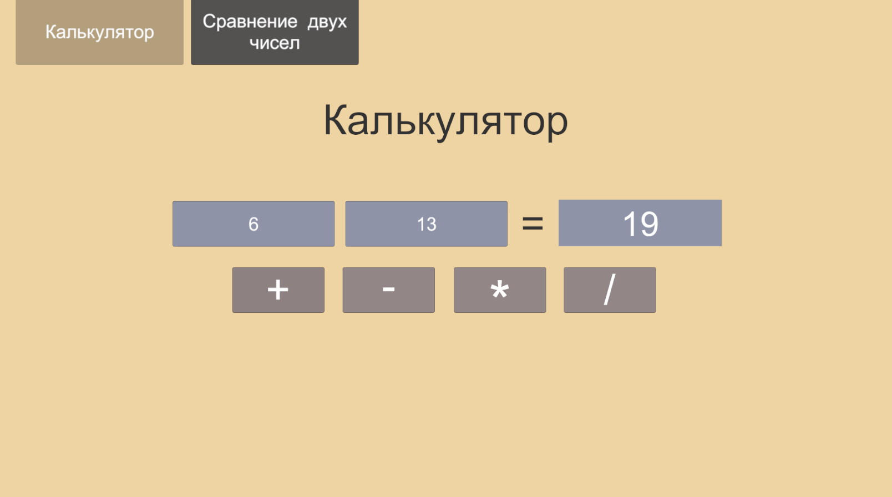
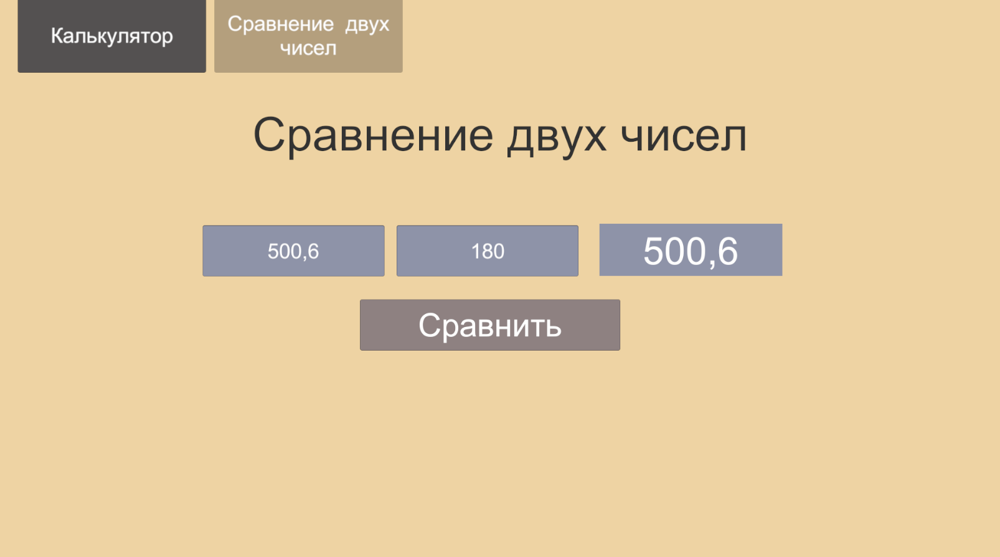

# Создание двух небольших программ на интерфейсе с использованием скриптов
 В этом проекте я создал 2 небольшие программы:  
 1) Калькулятор, который умеет работать с двумя числами
 2) Программа, которая умеет сравнивать 2 числа и выводить наибольшее из них, либо сообщение о равенстве чисел

 Каждая из программ создана на отдельной панели в канвасе. Для каждой из них есть отдельный скрипт с логикой.  
 Между программами можно переключаться с помощью кнопок вверху слева. Ниже показаны изображения работы программы.
 
 
