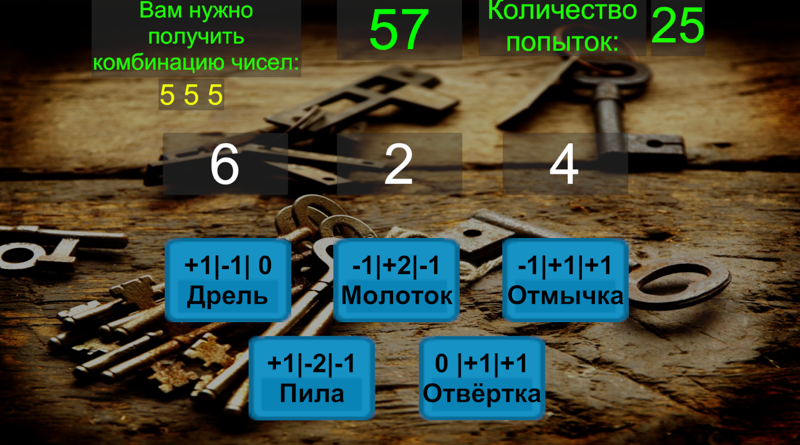
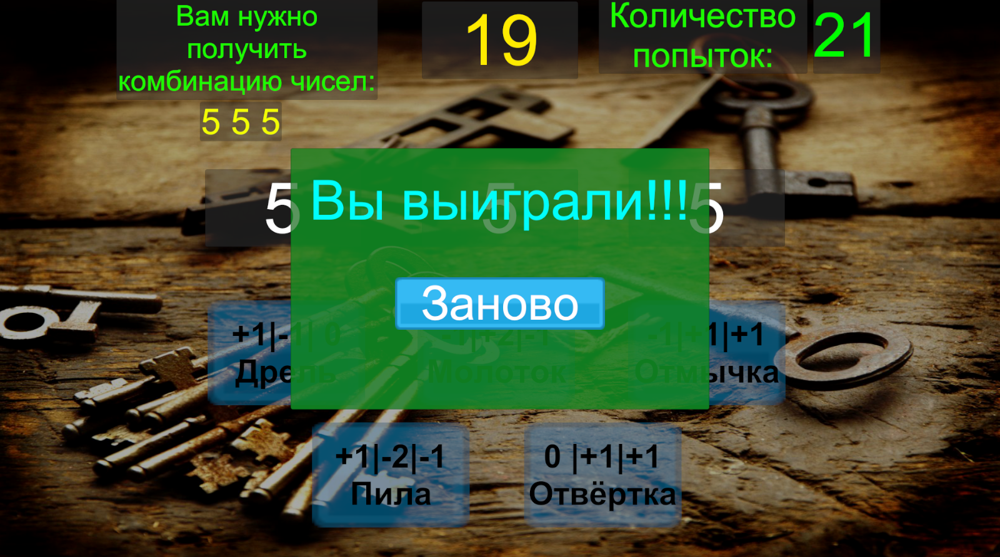
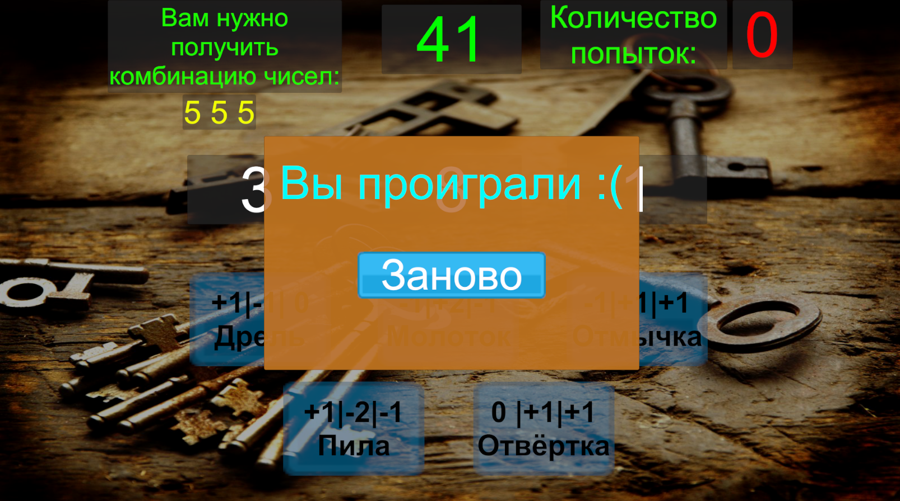

# Мини-игра с подбором комбинации чисел на время
 В этом проекте я создал мини-игру, где игроку необходимо подобрать комбинацию из чисел.  
 -
 На подбор комбинации даётся 1 минута. С помощью кнопок можно менять числа в этой комбинации, но каждое 
 нажатие кнопки уменьшает количество возможных нажатий, а всего их 25.  
 Если игрок успевает подобрать комбинацию, то появляется окошко с поздравлением о победе. В противном случае 
 появится окошко, сообщающее о проигрыше.  
 Также на обоих окошках есть кнопка, по нажатии на которую игра начинается заново.  
 Ниже показаны скриншоты программы:
 
 
 
 

 Одна из победных комбинаций: нажать по 1 разу на дрель, молоток, отмычку и отвёртку
