# Продолжение прошлого задания. Ещё один уровень, построенный с помощью ProBuilder. Применение материалов с различными текстурами
 В этом проекте я создал ещё один уровень через ProBuilder, добавил меню на выбор уровня, сделал переходы между уровнями.  
 На большинство объектов наложил материалы с текстурами. Теперь игрок - это как будто птица, свёрнутая в шар, которая 
 при движении оставляет шлейф из перьев. Получилась полноценная игра с двумя уровнями. На каждом уровне разбросаны монеты, некоторые спрятаны, 
 а некоторые скрыты за препятствиями.

 Вот скриншоты игры
 -
 Стартовое меню
 
 Главное меню с выбором уровня
 
 Начало первого уровня
 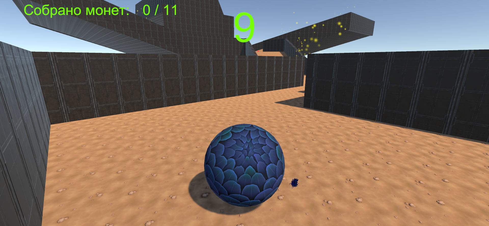
 Локация с испытаниями
 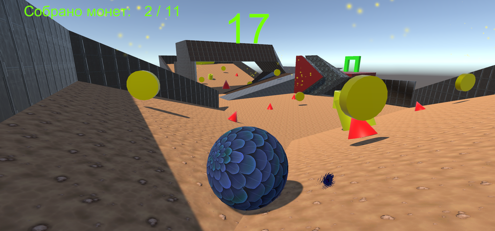
 Конец Первого уровня
 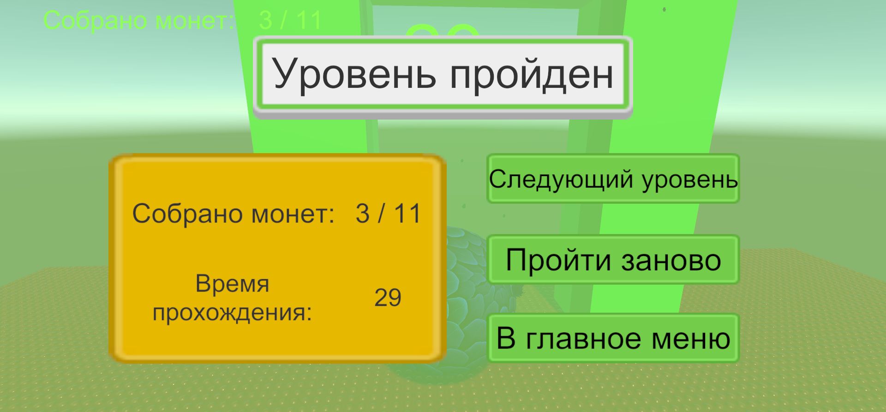
 Весь первый уровень с видом сверху
 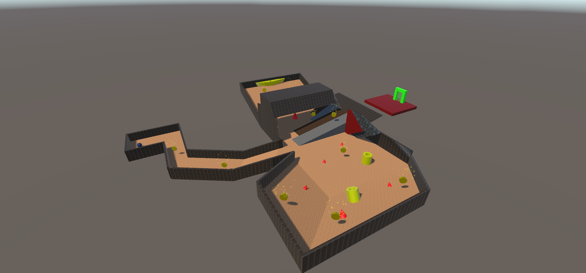 
 Начало второго уровня
 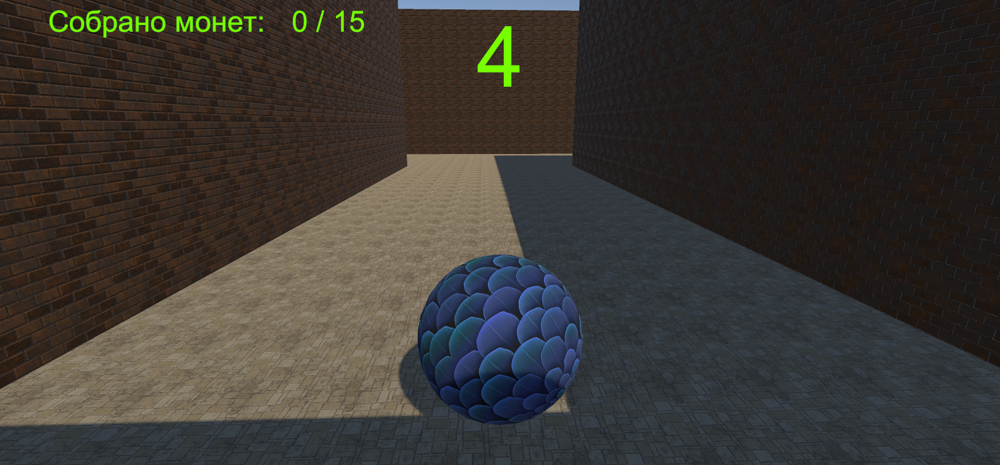
 Меню паузы
 
 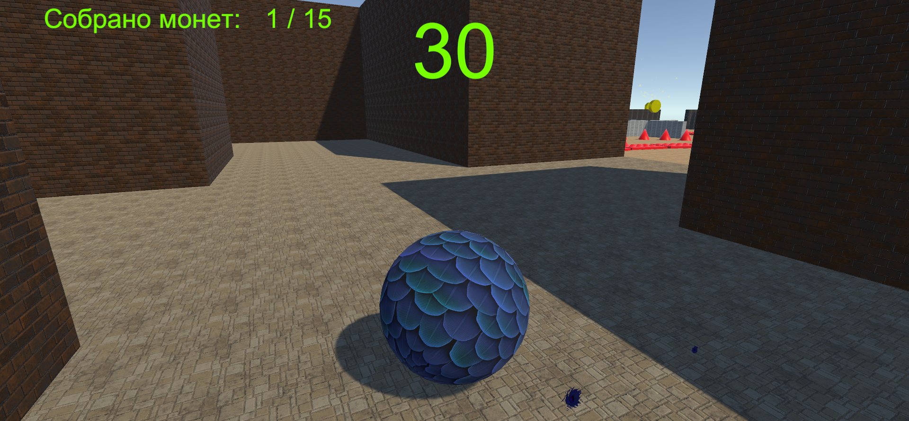
 Локация с испытаниями
 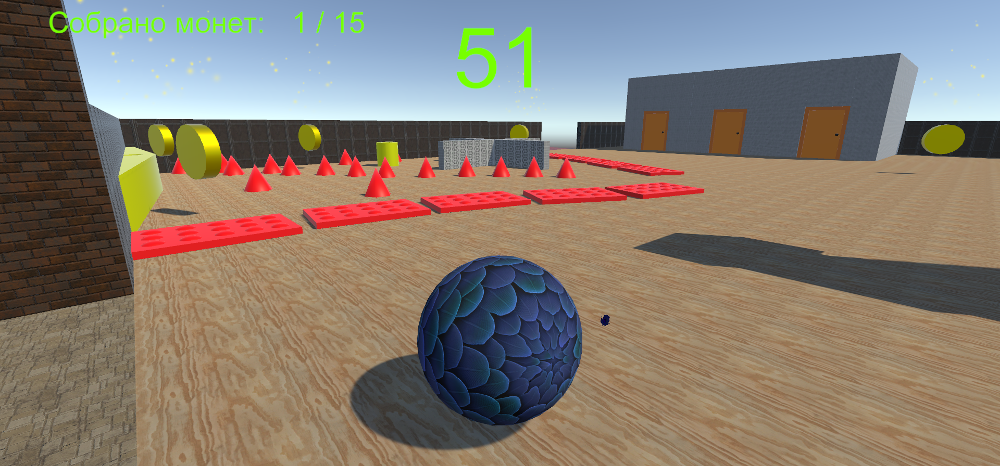
 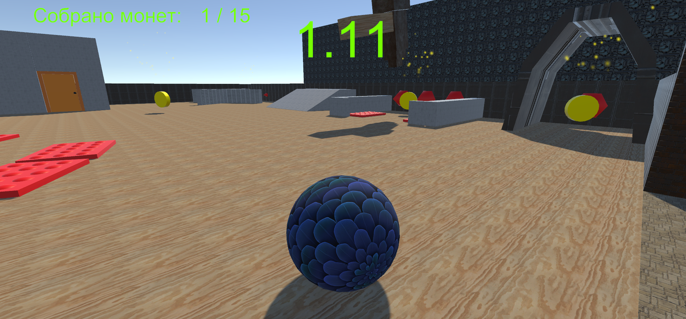
 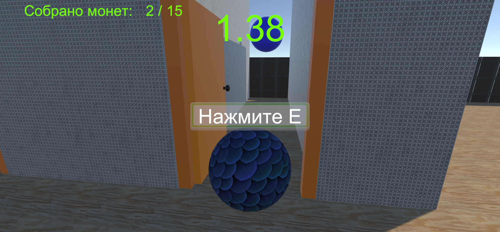
 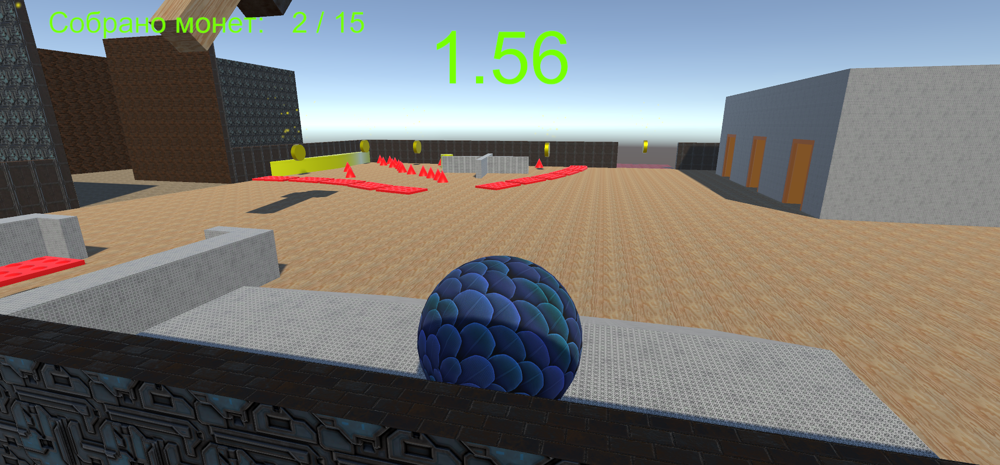
 Дорога к финишу
 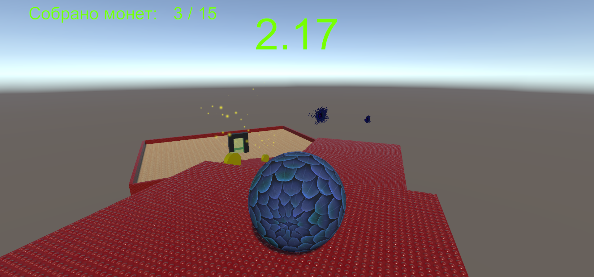
 Проигрыш в случае падения
 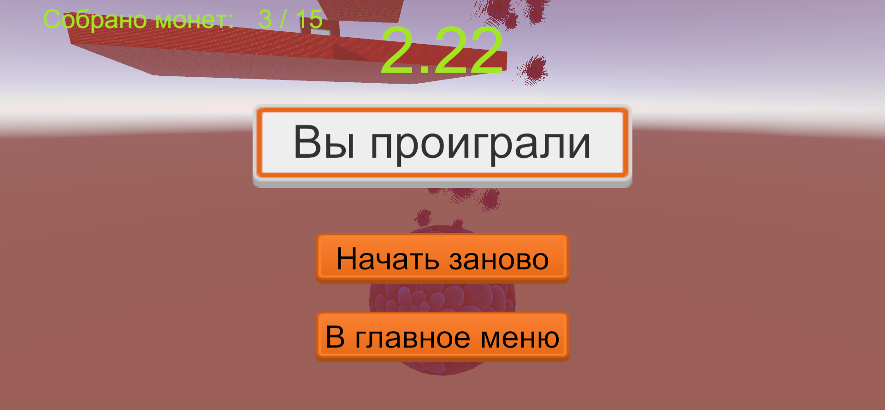
 Победа с появлением фейерверков слева и справа от портала
 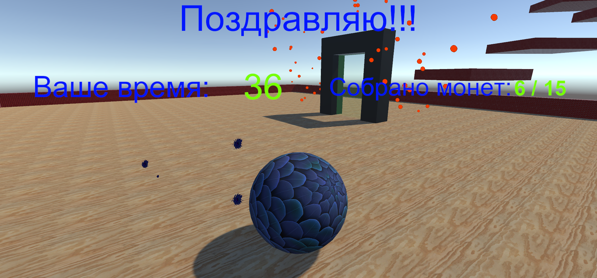
 Весь второй уровень с видом сверху
 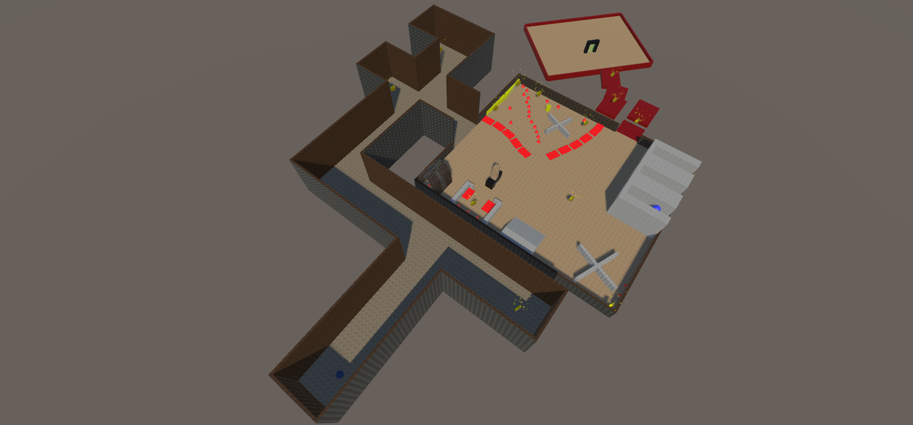
