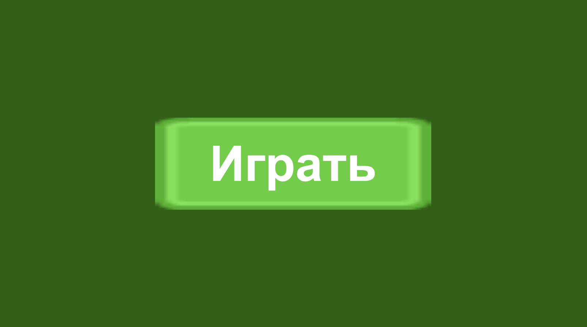
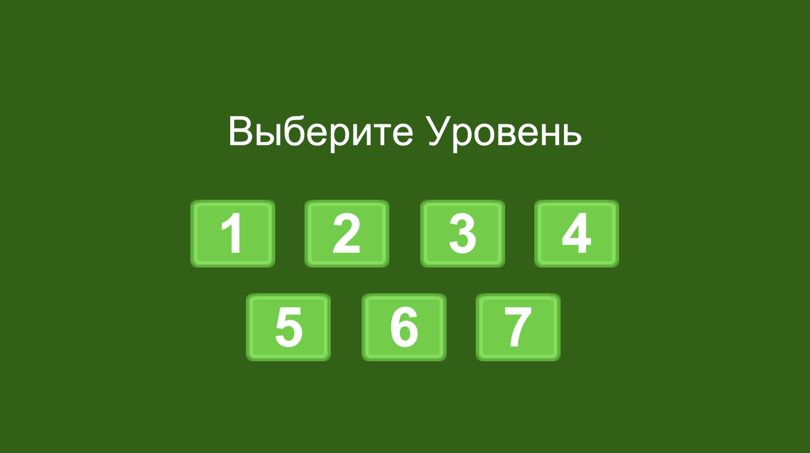
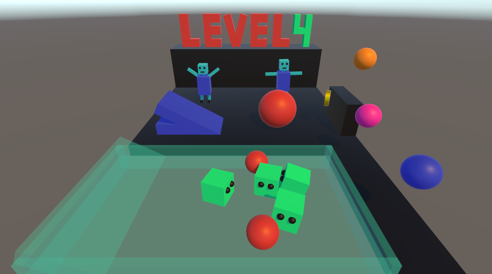

# Анимации и переход между сценами(уровнями) через меню
 В этом проекте я сделал несколько сцен(уровней), между которыми можно переключаться с помощью меню. Сами по себе 
 уровни одинаковые по наполнению, но целью было именно реализовать возможность перехода между ними. Также есть возможность 
 перезапустить уровень, находясь в нём.  

На каждом уровне есть несколько объектов с разной анимацией. Например, прыгающий мячик; крутящиеся монетки, которые исчезают 
при соприкосновении с катящимся шариком; 2 робота, которые сменяют одну анимацию на другую в случайном порядке; кубики на льду, у 
которых есть анимация, когда они в покое, то почти есть не двигаются, а также анимация в движении.

Вот несколько скриншотов (здесь показаны 1 и 4 уровни, но есть выбор любого от 1 до 7)

Вот так выглядит меню паузы при нажатии на escape. Можно продолжить игру, перезапустить сцену или вернуться в главное меню для выбора уровня.

