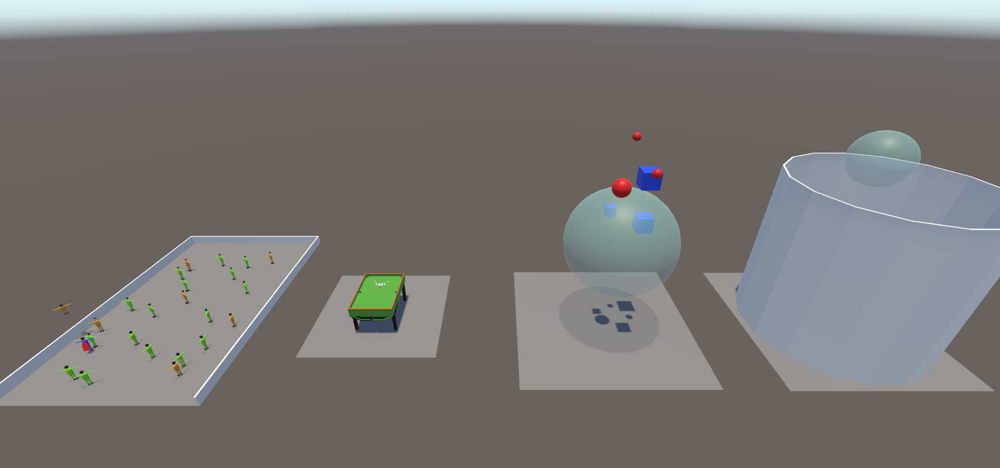
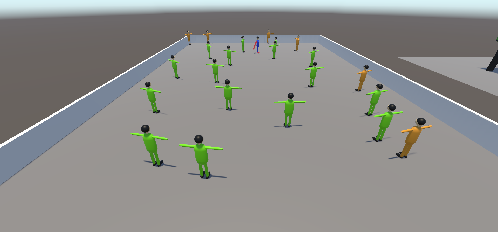
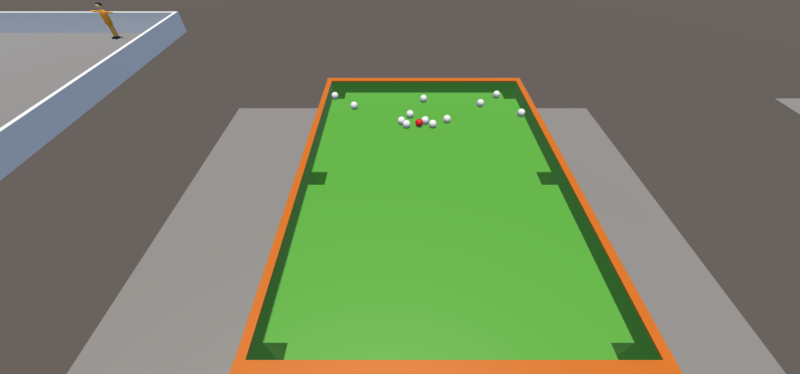
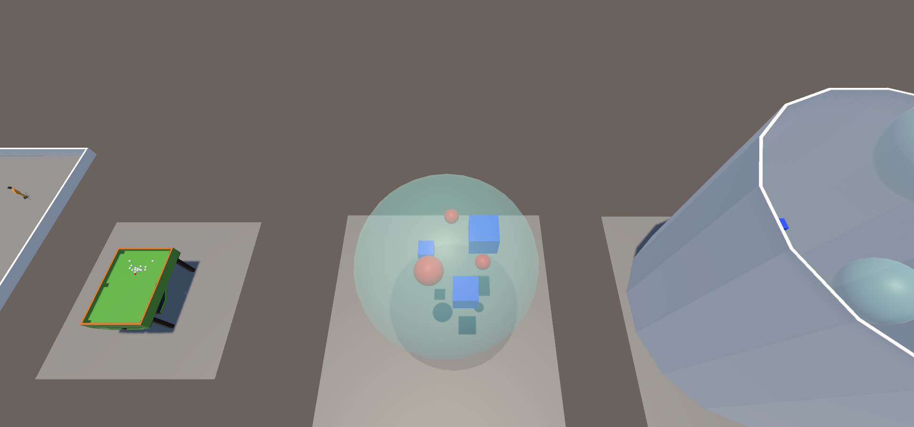
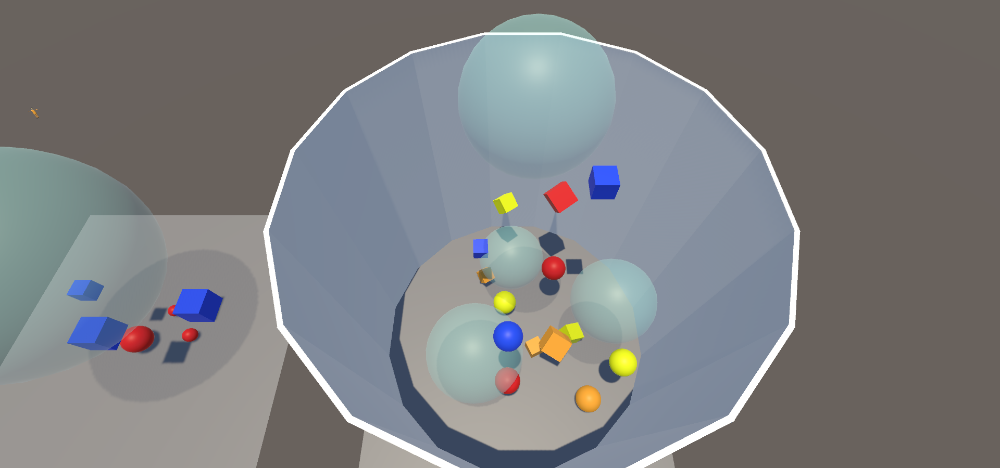

# Использование физики, слоёв, тригеров, взрывов
 В этом проекте на одной сцене я создал несколько примеров с использованием физики.  
 
 В первом герой перемещается от одного злодея к другому, отталкивая их, при этом игнорируя мирных людей. 
 
 Во втором приведена имитация бильярдного стола, где в начале сцены на шар биток подаётся сила, и он разбивает остальные шары.  
 
 В третьем создана сфера, которая является тригером. У падающих объектов, попадающих в неё, отключается гравитация.  
 
 В четвёртом построена труба, внутри которой находятся объекты, а в центре трубы находится источник взрыва, который срабатывает 
 каждые 3 секунды. Объекты одного цвета также имеют определённое трение и прыгучесть (на них наложен физический материал). 
 Стены трубы тоже имеют собственную прыгучесть. Под действием взрыва объекты разлетаются и отталкиваются от стен. Для эксперимента я 
 также добавил сферы невесомости внутрь трубы в случайном порядке.  
 
