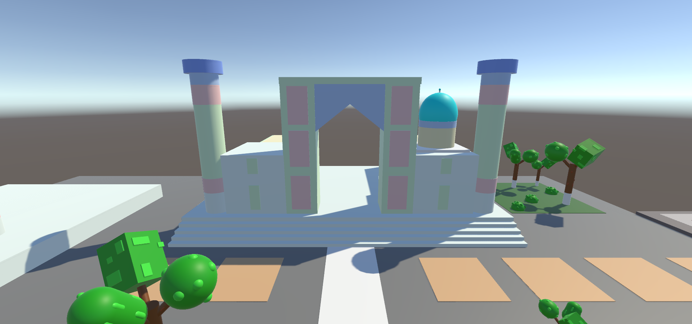
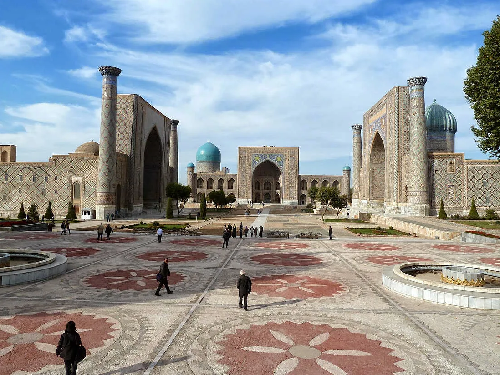
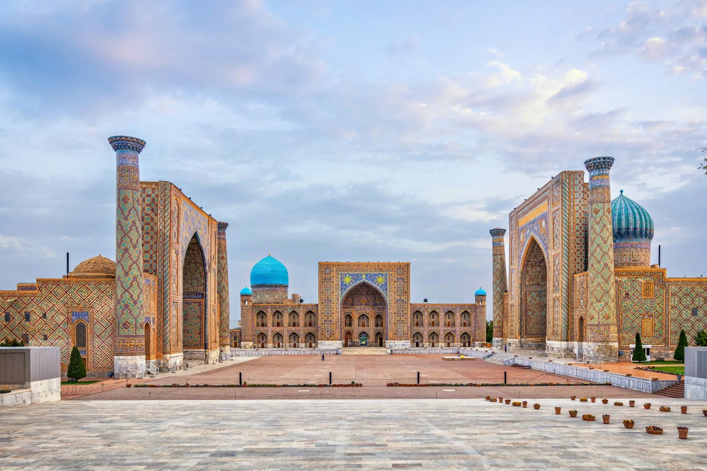

# Городская площадь в Узбекистане

В этом проекте я создал локацию "Регистан".  
**Регистан** (так называется площадь) - площадь в центре города Самарканд, который находится в Узбекистане.  

Все объекты на локации созданы из примитивов в Unity, таких как куб, сфера, цилиндр и капсула.  
На локации есть 2 фонтана, множество деревьев, скамейки, а также 3 Медресе (мусульманских учебных заведения).

Ниже представлены изображения сцены в Unity с разных ракурсов.  
-

А теперь изображение площади в реальности.
-

