# Unity projects
 В этом репозитории хранятся мои проекты на юнити.  
 Каждый проект находится в своей ветке, где можно ознакомится с ним подробно. Ниже кратко показаны скриншоты этих проектов.

 Проект 1: Площадь "Регистан"
 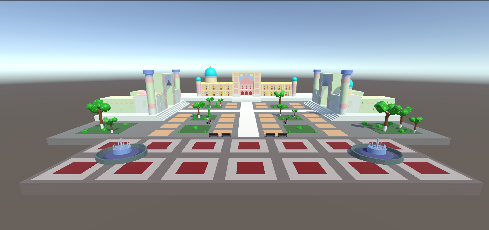
 Проект 2: Локация жилого района
 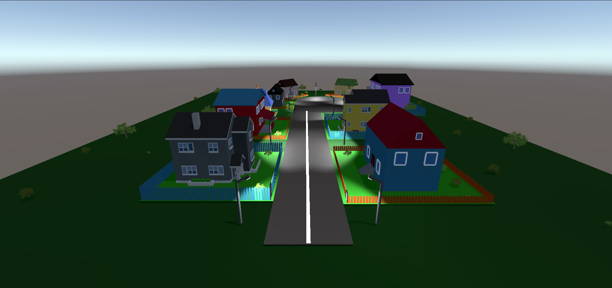
 Проект 3: Интерфейс игры с изображениями и кнопками
 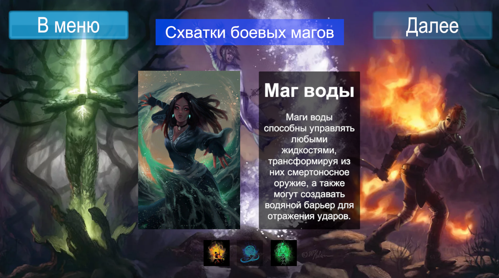
 Проект 4: Интерфейс с реализацией калькулятора и сравнения двух чисел
 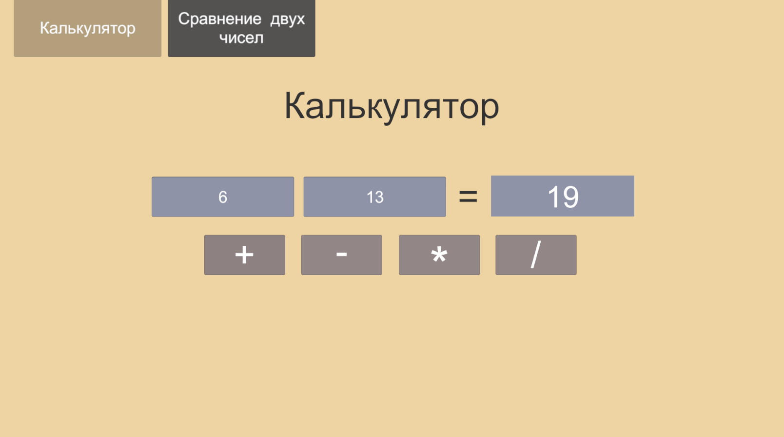
 Проект 5: Небольшая консольная программа
 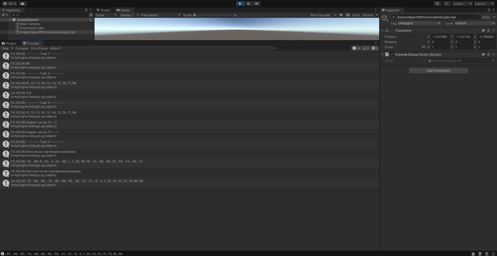
 Проект 6: Игра про взломщика через интерфейс
 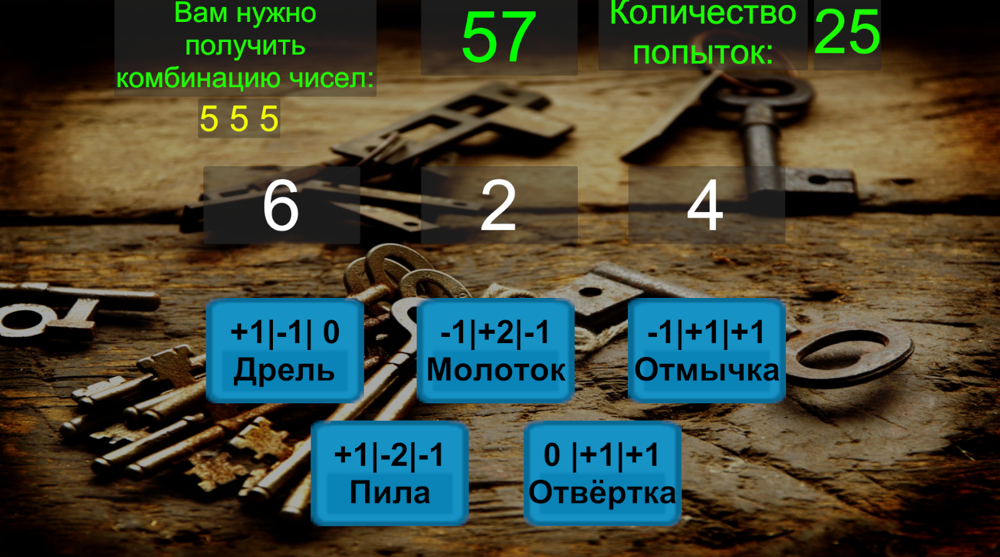
 Проект 7: Игра "Защити поселение"
 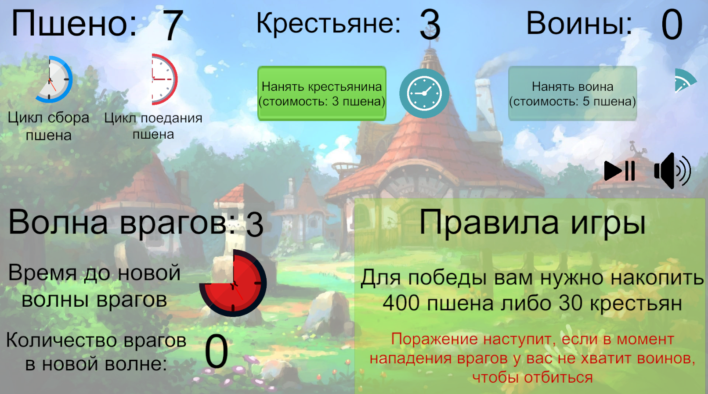
 Проект 8: Полёт ракеты от точки к точке и эстафета с передачей палочки
 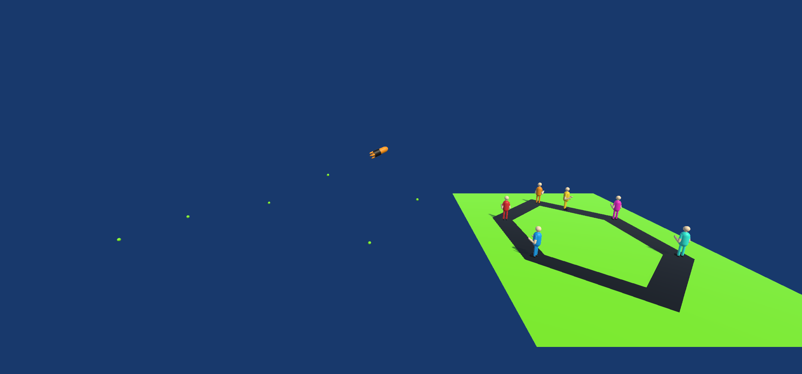
 Проект 9: Использование физики, слоёв, триггеров и взрывов
 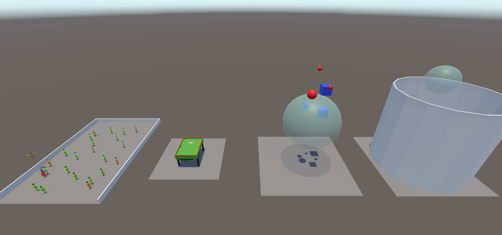
 Проект 10: Физика и джоинты
 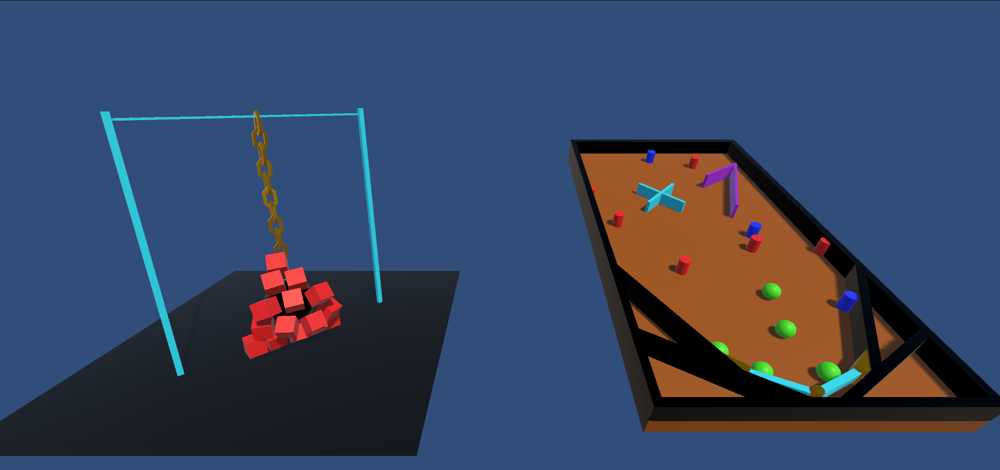
 Проект 11: Анимации и переход между сценами
 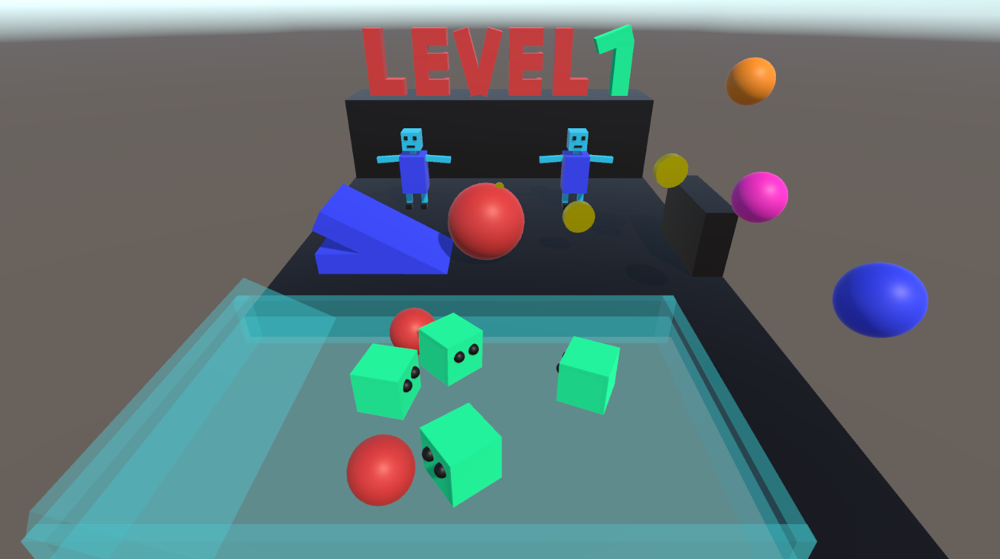
 Проект 12: Игра про шарик на сбор монеток и прохождение уровней
 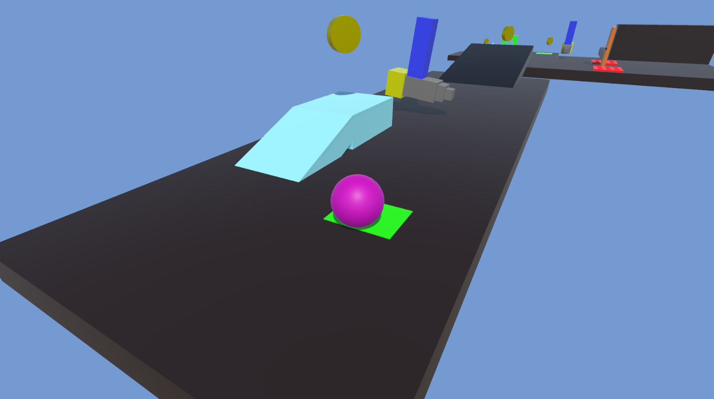
 Проект 13: Та же игра про шарик, но с добавлением систем частиц и различных препятствий
 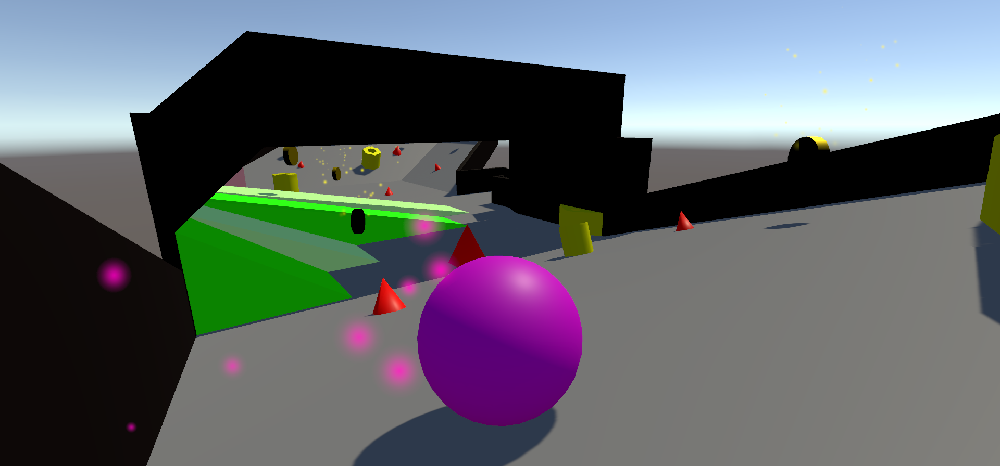
 Проект 14: Законченный вид игры про шарик с двумя локациями, с материалами на объектах, системой частиц, красивым меню
 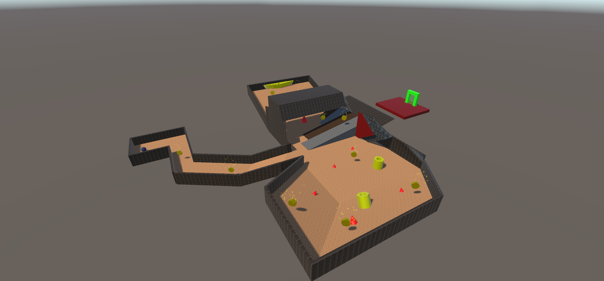
 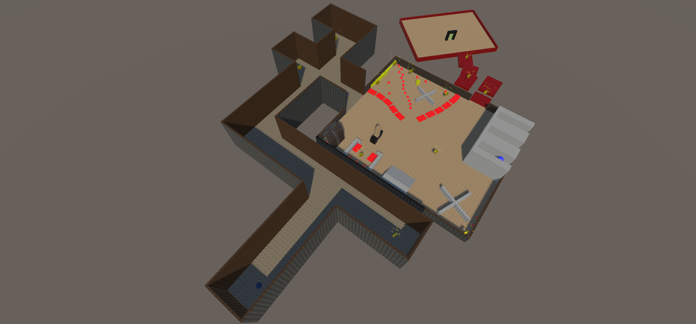
 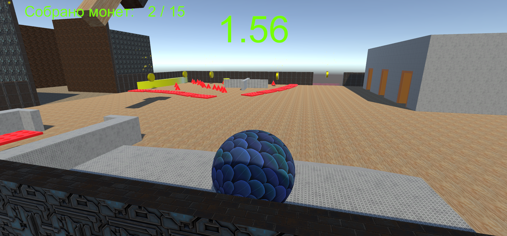