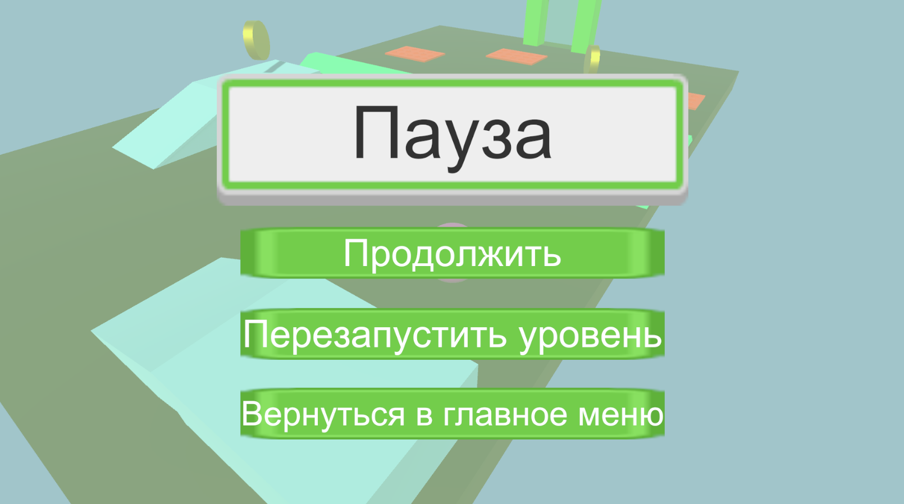

# Игра про шарик с разными уровнями
 В этом проекте я создал игру про шарик с тремя уровнями. Шариком можно управлять во всех направлениях. Также можно 
 вращать камеру (она всегда смотрит на шарик и движется за ним).  
 При входе в игру игрока встречает кнопка 'Играть'. При нажатии на неё происходит переход на меню с выбором одного из 
 трёх уровней. Рекомендуется начать с первого уровня и проходить их последовательно.  

 На каждом уровне есть монетки, разбросанные в разных местах. Их можно собирать. 
 Также на каждом уровне есть множество препятствий. Например, это красные плиты, при соприкосновении с которыми игрок погибает. 
 Есть пара кнопок, позволяющих включить или выключить объект на сцене. Вращающиеся молотки, лопасть, трамплины, двери.  
 Цель игрока - собрать как можно больше монет и дойти до финиша за меньшее время. Финиш - это портал в конце уровня, при входе в 
 который всплывает UI окно с результатами прохождения уровня и кнопками для дальнейших действий.  
 В случае смерти появляется соответствующее UI окно об этом.

 Вот скриншоты игры:
 -
 **Стартовое меню**
 
 **Главное меню**
 
 **Первый уровень**
 
 **Меню паузы**
 
 **Окошко в случае проигрыша**
 
 **Финиш с результатами на первом уровне**
 
 **Второй уровень**
 
 **Зелёная кнопка, которая включает или выключает объекты на сцене**
 
 **Дверь и возможность её открыть либо закрыть**
 
 **Вращающиеся лопасти**
 
 **Финиш с результатами на втором уровне**
 
 **Третий уровень**
 
 **Середина третьего уровня**
 
 **Финиш с результатами на третьем уровне**
 
 
