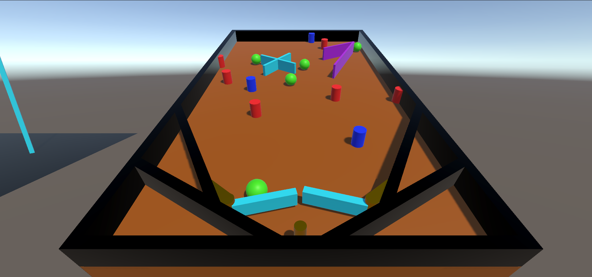

# Джоинты
 В этом проекте я создал 2 примера.  
 
 В первом из них сделан шар на цепи. Цепь сделана из звеньев, которые соеденены с помощью Hinge joint. В начале игры 
 шар на цепи падает вниз и разбивает пирамиду из кубиков.  
 
 Во втором я создал мини игру пинбол. Рычаги реализованы с помощью того же hinge joint (они срабатывают автоматически каждые 3 секнды). 
 Также я добавил отталкивающие, крутящиеся и двигающиеся препятствия на пути шариков.  
 
