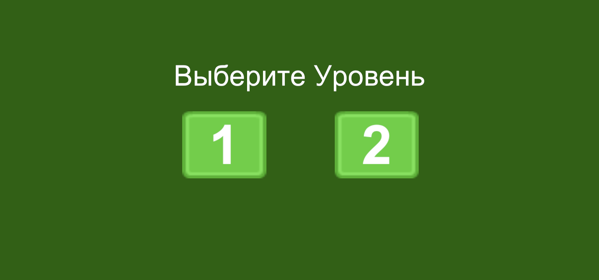

# Создание интерфейса
 В этом проекте я создал интерфейс некой игры "Схватки боевых магов".  
 Игрока встречает главное меню игры, где есть 3 кнопки: "Играть", "Правила" и "Автор".
 
 При нажатии на кнопку "Правила" мы попадаем в меню с правилами.
 
 Кнопка "В меню" возвращает обратно в главное меню.
 Кнопка "Автор" переносит в меню, где написано, кто сделал игру.
 
 При нажатии на кнопку "Играть" мы попадаем в меню выбора персонажа - одного из трёх боевых магов
 
 Кнопка "Далее" сделана неактивной, так как дальнейшей логики в этом проекте нет.  
 Маленькие кнопки внизу соответсвуют своему персонажу. Ниже показаны ещё 2 мага.
 
 
