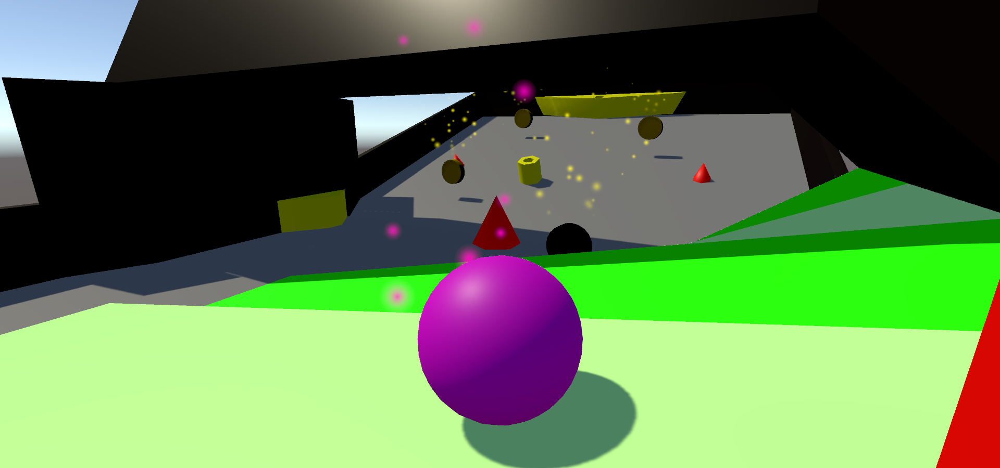

# Построение локации с помощью ProBuilder. Использование Particle system для разных эффектов
 В этом проекте я построил локацию для шарика(игрока) с помощью ProBuilder.  
 На этой локации я расположил анимированные монетки с эффектами от системы частиц, которые игрок может собрать. 
 На локации также есть смертельные красные конусы, при соприкосновении с которыми шарик взрывается (на месте из частиц создаётся взрыв), 
 и затем через 3 секунды игрок появляется на месте респавна. Помимо этого ещё есть жёлтые отталкивающие цилиндры. Используйте их для 
 веселья и большей скорости)

 Скриншоты игры:
 -
 **Начало локации**
 
 **Зона с препятствиями**
 
 
 
 **Эффект взрыва при смерти шарика**
 
